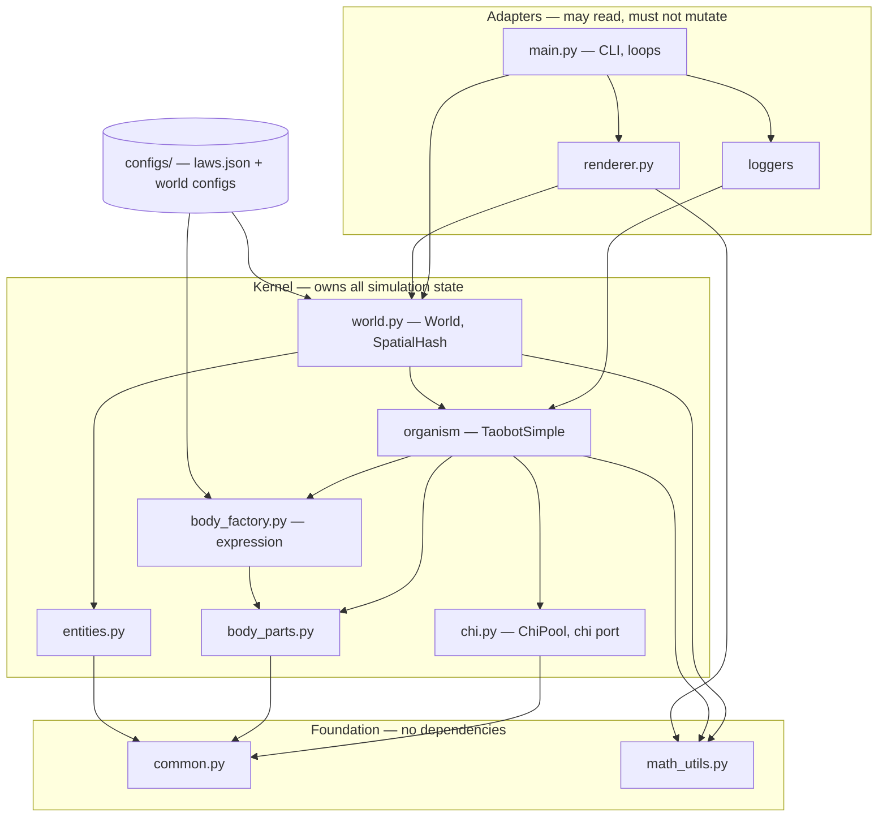
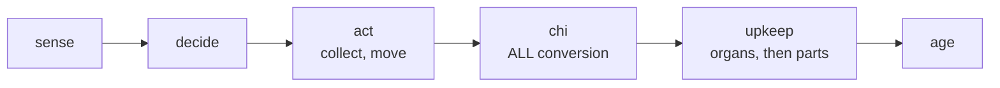
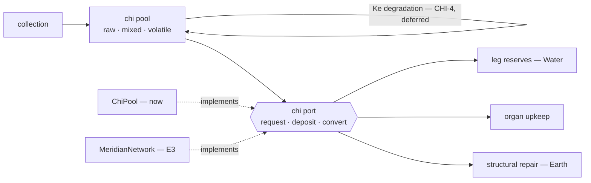

# Architecture Spine — taobots simulation core

## Design Paradigm

**A deterministic, tick-phased simulation kernel with ports at every boundary.**

Three layers. Dependencies point one way only — inward, toward the foundation.



Two shapes recur throughout and carry most of the design:

**Ports.** Where one subsystem will be replaced by a more capable one later, callers talk to an interface, not an implementation. Chi supply, reference resolution, and derived properties are all ports. Each organ epic is then a *substitution* rather than a refactor.

**Placeholder → derived.** Scalars that stand in for anatomy that has not been built yet become computed quantities as that anatomy lands. This is the project's central staging device, and it is why `AD-5` is load-bearing.

## Invariants & Rules

### AD-1 — Tick phases are named, ordered, and exhaustive

- **Binds:** the organism tick, every organ epic, every future subsystem
- **Prevents:** two subsystems assuming different orderings; conversion running at two points in a tick (the source of double-conversion and threshold thrashing)
- **Rule:** one tick is `sense → decide → act (collect, move) → chi → upkeep → age`. **All** conversion — passive Sheng and any demand-triggered path — happens in the `chi` phase, computed from a single pre-tick snapshot. Within `upkeep`, **the body resolves before every other part** — it is the only thing that can die (`AD-6`), so it outranks parts that merely stop working. No work happens outside a named phase. A phase may later carry a period, so no code may assume it runs exactly once per tick when accumulating.



### AD-2 — Chi has two tiers

- **Binds:** `CHI-1`…`CHI-7`, `MER-4`, all storage and all part reserves
- **Prevents:** a second storage idiom appearing at E3; destructive-cycle degradation being applied at the wrong tier
- **Rule:** **Pool** — raw, mixed, volatile; what eating deposits; where co-present incompatible elements degrade each other (`CHI-4`, deferred). **Buffers** — per-element, single-element and therefore stable; meridians, with `LegPart.reserve` as the existing instance. Today's `TaobotSimple.storage` **is the pool tier**; buffers separate out of it at E3. Nothing may treat the pool as a stable per-element store.

### AD-3 — Chi is reached only through a port

- **Binds:** every part, every organ drain, collection, conversion
- **Prevents:** callers coupling to the pool's data shape, which makes E3 a rewrite instead of a substitution
- **Rule:** consumers call `request(element, amount) -> granted` and `deposit(element, amount) -> accepted`. No consumer mutates a chi dict. `ChiPool` implements the port now; `MeridianNetwork` implements it at E3 while sitting on the pool. **A part is handed its port**, never reaching for a global one. Under partial supply, an element is split **pro-rata by demand across every requester of that element** — not equal shares, and not within organ systems, because structural repair (`AD-8`) makes parts of *different* systems compete for Earth in the same tick. **A denied request is correct behavior** — at E3, `request()` may return zero because the taobot has no meridian of that element; that is the intended selection pressure and must not be "fixed".



### AD-4 — Conversion belongs to the chi tier

- **Binds:** `MER-14`, `CHI-7`, E1-S2, the Sheng cycle
- **Prevents:** conversion logic accreting on the organism, where E3 cannot lift it
- **Rule:** element-to-element conversion, respecting `CYCLE_EFFICIENCY`, is a capability of the chi tier — not a method on `TaobotSimple`. It lands on `ChiPool` and is inherited by `MeridianNetwork` at E3. Any conversion path derives `spent` from `produced` **after** capping on available room, so essence can be lost to efficiency but never manufactured.

### AD-5 — Placeholder scalars are derived, and always read through an accessor

- **Binds:** organ values, `speed`, `sensing_range`, `storage_capacity`, and every future emergent trait
- **Prevents:** the failure that already happened — `organs[WATER]` going vestigial when `LegPart` took over locomotion cost, logging a constant `100.0` in every run to date while `PLAN.md` still claimed it governed speed
- **Rule:** an organ value is a **derived summary statistic over the parts of that element** — the **mean** of their structural integrity — not stored state. **An organ system with no parts reads as `0.0`**: absent and destroyed are indistinguishable, deliberately, because a bot with no legs should be as immobile as a bot with shattered ones.

  **The transition is per-organ and happens in that organ's own epic** — Water at E1, Metal at E2, Wood at E3, Fire at E4; Earth becomes derived as soon as the body singleton exists. Until an organ's parts are built it keeps its placeholder scalar. Deriving an organ *early* would read as `0.0` and silently disable the capability it governs — converting Metal before E2 builds armor parts, for instance, would strip all damage absorption and make hazards abruptly lethal. The same holds for any trait that anatomy will eventually produce: `speed` from legs, `sensing_range` from eyes, `storage_capacity` from meridian size and count. All such properties are read through an accessor, never as a bare field, so the flip from stored scalar to computed-from-parts changes one function rather than every caller.

### AD-6 — Exactly one death condition

- **Binds:** E1–E4 and every future organ epic
- **Prevents:** five interacting death rules with unpredictable joint behavior
- **Rule:** a taobot dies when **body (Earth) integrity** falls below its minimum. No other organ system may introduce a death rule. Broken legs, dead neurons and collapsed meridians kill only by cascade into starvation.

### AD-7 — Earth is the body; Wood is the transport network

- **Binds:** death, damage routing, flee trigger, metabolic multiplier, E3
- **Prevents:** E3's Wood-consuming meridians colliding with Wood-as-death-organ, which would make building meridians lethal and a well-connected taobot structurally fragile
- **Rule:** **Earth** = body/structure — death condition, damage target, flee trigger. **Wood** = meridians/transport — metabolic multiplier, collapse trigger. The current code implements these swapped; `PLAN.md`'s organ table is the erroneous source, contradicted by `docs/domain-spec.md`'s element-to-part map, `MER-1`, `STR-1`, `STR-2`, and `PLAN.md`'s own epic table. **The body is a singleton part**, so Earth's organ set has exactly one member.

### AD-8 — Every part has a function element and a structural element

- **Binds:** `STR-2`, `LEG-6`, `ARM-5`, all body parts
- **Prevents:** each organ epic reimplementing degrade-and-repair for its own part type
- **Rule:** a part draws its **function element** for work (Water for legs, Metal for armor, Fire for neurons) and **Earth** for structural repair, per `STR-2`. Degrade-and-repair lives on the `BodyPart` base, not in any subclass. The body is the degenerate case where both elements are Earth.

### AD-9 — Two ID spaces, never collapsed

- **Binds:** genome format, `BodyFactory`, every part type, `GEN-1`, `GEN-2`
- **Prevents:** a runtime-random id leaking into a genome, or a gene id being reused across the several parts one gene expresses
- **Rule:** **gene/spec id** is genome space — stable, declarable, how genes reference each other, persists in the genome file. **part id** is runtime space, assigned at expression. A part records the instruction that produced it; provenance runs gene → parts only. Because expression is one-to-many (`BODY-6`), a part id can never be *equal to* a gene id — but it must be **deterministically derived** from `(run seed, gene id, expression index)`, not `uuid4()`. `uuid4()` draws from `os.urandom` and is unreachable by any seed, so a random part id would break `AD-12` the moment a part id reaches a state hash, a log, or any iteration order.

### AD-10 — `BodyFactory` is an expression engine, not a constructor

- **Binds:** `MER-9`, `MER-13`, `NEU-9`, `BODY-6`, the body spec format
- **Prevents:** E3 hard-wiring junction lookup into meridian code where Phase 4 and Phase 6 cannot replace it
- **Rule:** expression is two passes — instantiate parts from instructions, **then** resolve the references those instructions declared. The hand-written body spec is a stand-in for a genome and keeps the shape a genome will have.

### AD-11 — Reference resolution is a replaceable strategy

- **Binds:** `MER-9`, `NEU-9`, `BODY-6`; open question `Q8`
- **Prevents:** the first epic that needs cross-part references answering the question permanently and by accident
- **Rule:** resolving a gene-space reference to runtime parts sits behind one interface with swappable implementations — explicit lookup while specs are hand-written, spatial (nearest by polar distance) once mutation generates body plans nobody wrote, gradient-driven at Phase 6. Never inline in a part class or a caller.

### AD-12 — The simulation is reproducible by construction

- **Binds:** `world.py`, the organism, all future stochastic subsystems, every logged run
- **Prevents:** the shared-stream failure — one agent taking an extra draw shifts every subsequent agent's numbers, so any behavior change silently destroys the reproducibility of every recorded run
- **Rule:** three parts, all required.
  1. **No shared global RNG.** Explicit `random.Random` instances: one per entity, seeded by a single derivation function from `(world_seed, entity_id)`; one for the world (spawning, placement); later one for mutation from `(world_seed, generation)`.
  2. **Order-sensitive paths sort by a stable key.** `SpatialHash.neighbors` returns a set and the `query_*` methods sort on distance alone, so ties resolve by set-iteration order and float summation is order-dependent. `entity_id` is the tiebreaker.
  3. **Every run writes a manifest** — seed, config name, git SHA, Python version, timestamp. Today `--seed` is accepted but never recorded, so no existing log can be replayed.

  Determinism is **tested, not assumed**: same seed, N ticks, twice, identical state hash.

### AD-13 — Four homes for tunables, decided by the law test

- **Binds:** every constant in the codebase, Phase 2 exit criterion 1, Phase 4
- **Prevents:** organ settings staying global to the world (two bots cannot currently differ in them, so the differentiation criterion is unevaluable) and genetics being unable to evolve anything held in module scope
- **Rule:** the test is — **would making this evolvable let organisms escape a constraint the simulation exists to impose?** If yes it is a law and must be exogenous.

  | Home | Holds | Varies per |
  | --- | --- | --- |
  | `configs/laws.json` | Laws — conversion efficiency, elemental degradation, metabolic cost per unit of work | Shared by all worlds; an arena may **deliberately** override named entries |
  | World config | Environment — size, population, spawn counts, densities, respawn | Run |
  | Genome / organism spec | Traits — anatomy, part counts, positions, per-part params | Individual |
  | Module constant | Structural invariants only — e.g. `ORGAN_MAX` as a scale unit | Never |

### AD-14 — The workshop is a microscope, not a different world

- **Binds:** `configs/workshop.json`, every constant derived in workshop mode, E1-S1…S4
- **Prevents:** constants tuned against an environment whose pressures differ from the world they will run in
- **Rule:** the workshop may differ in size and population — that is what makes it a single-bot sandbox — but the **rates a bot experiences** must match the world being calibrated. Laws are shared by construction (`AD-13`); densities and respawn are aligned deliberately, and any divergence is recorded with its reason.

### AD-15 — World owns world state

- **Binds:** the organism, renderer, loggers, and Phase 3 `sensing.py` / Phase 5 `collision.py`
- **Prevents:** a future mover updating a position without re-registering it, silently desyncing the spatial index so neighbour queries answer from stale positions
- **Rule:** `World` exposes queries and commands — `get_resource`, `get_taobot`, `move_taobot`. Nothing outside `World` touches `_`-prefixed attributes. **Position changes go through `move_taobot`**, which owns torus wrap *and* index update so the two cannot be separated.

### AD-16 — Observers read; they never mutate

- **Binds:** all loggers, the inspector, genome export, the future game layer
- **Prevents:** the simulation not being independent of its observers — today the interval accumulators mean different things depending on which logger is attached and how often it runs, and grow unbounded with logging off
- **Rule:** the organism accumulates its own per-tick deltas; observers read and compute their own intervals. No observer resets simulation state. Anything that **persists or transmits** state consumes a `get_state()`-style snapshot rather than live objects. Read-only live access for bulk rendering is explicitly permitted — the line defended is mutation and persistence, not reads.

### AD-17 — One organism class, hollowed in place; control is the deferred seam

- **Binds:** the organism module, E1–E4, the Phase 3 neural work
- **Prevents:** a parallel "full" taobot class built alongside the current one, which would require a big-bang cutover that the per-subsystem staging never offers; and a class hierarchy whose split axis (organism type) is orthogonal to the real staging axis (subsystem, one per epic — a hierarchy cannot express "Water is derived but Metal is not yet")
- **Rule:** there is exactly **one** organism class. Each epic substitutes a subsystem *inside* it, so the class thins rather than being replaced — what remains by Phase 4 (identity, position and heading, the part list, the chi pool, physics integration, tick orchestration, metrics) is arrived at by subtraction. `sense` + `decide` together constitute **control** and are the unit E4 replaces wholesale, per the mechanism-before-control principle in `docs/domain-spec.md`. They stay as methods until a second controller exists, then move behind a controller port; the interface is already narrow — they read sensed lists and world dimensions, and write `_desired_heading`, `behavior_state`, `target_entity_id`. The module is renamed `taobot.py` in E1-S0a, since `TaobotSimple` already owns the organ model and will own a gene-expressed neural organism.

## Consistency Conventions

| Concern | Convention |
| --- | --- |
| Naming — parts | `<Function>Part` (`LegPart`, `MeridianPart`, `ArmorPart`, `NeuronPart`), one class per part type in `body_parts.py` |
| Naming — requirements | Stable ids from `docs/domain-spec.md` (`LEG-6`, `MER-9`); never reused or renumbered. Stories and commits cite them |
| Naming — derived properties | Accessor, not field: `effective_speed()`, `organ(element)` — per `AD-5` |
| Positions | Virtual units always (80 × 60 default world). Pixels exist only past the render boundary, via `math_utils.world_to_screen` |
| Geometry | All distance and direction through `math_utils.torus_*`. The world wraps at every edge, so plain Euclidean math is silently wrong near boundaries |
| Body geometry | Polar `(r, theta)` from the taobot centre, per `BODY-2` |
| Ids | `entity_id` — int, world-allocated, runtime. `part_id` — UUID, expression-time. `gene_id` — declarable, genome-space (`AD-9`) |
| Chi access | Through the port only (`AD-3`). Never a bare dict mutation |
| Randomness | Injected `random.Random`; module-level `random.*` is forbidden (`AD-12`) |
| Config formats | JSON. Element-keyed maps use `ElementType.name` (`"WOOD"`), normalised on load where they are weights |
| Constants | Every tunable carries a comment recording how its value was derived, in the style of `LEG_INTEGRITY_DEGRADE_SCALE`. A constant without a recorded rationale is an untuned balance parameter wearing a number |
| Acceptance | A part that cannot be watched tick-by-tick in the workshop inspector and logged by `WorkshopLogger` is not accepted. Adding an organ or part updates both in the same change |
| Logging | Fixed-name `*_deaths.csv` / `*_focal.csv` are overwritten per run; timestamped files accumulate |
| Errors | Config load raises `ValueError` naming the missing key. Unknown part type raises `ValueError` in expression |

## Stack

Ratified from the repository at `c70ed05` — this is a brownfield spine, so the project's existing pinning is the authority. Installed versions in `.venv` are recorded where they exceed the declared floor. **No upstream version review was performed in this run**; treat that as open work if you want current-release confirmation.

| Name | Declared | Installed |
| --- | --- | --- |
| Python | 3.11 (`target-version`) | 3.11.14 |
| pygame | `>=2.5.0` | 2.6.1 |
| pytest | `>=8.0` | 9.1.1 |
| ruff | `>=0.4` (line-length 100; `E`,`F`,`W`,`I`) | 0.16.2 |
| black | `>=24.0` (line-length 100) | 26.5.1 |
| mypy | `>=1.10` (`strict = false`) | 2.3.0 |
| numpy | Phase 3+, undeclared in `requirements.txt` | 2.4.6 (via notebooks) |

## Structural Seed

```text
taobots/
  common.py           # ElementType, cycles, names, colors — no dependencies
  math_utils.py       # torus math, polar↔cartesian, world→screen
  entities.py         # Resource, Hazard
  body_parts.py       # BodyPart base (function + structural element), LegPart, …
  body_factory.py     # expression: instantiate, then resolve references
  chi.py              # ChiPool — owns the ledger, implements the chi port
  world.py            # World, SpatialHash — owns all world state
  taobot_simple.py    # organism: tick phases, orchestration
  renderer.py         # all pygame drawing; reads, never mutates
  main.py             # CLI, run loops, loggers
  configs/
    laws.json         # shared laws — arenas override named entries deliberately
    *.json            # per-world environment
```

Everything in `PLAN.md`'s file table beyond this is later-phase and owned by its phase.

**Operational envelope.** A single local process — no services, no deployment, no network. Two run modes plus a sandbox: windowed pygame, `--headless`, and `--workshop` (always loads `configs/workshop.json`, ignores `--config`). Artifacts are local directories: `configs/` in, `logs/` and `saves/` out. Dependencies via `.venv`; the `Makefile` calls bare `python`/`pytest`, so it requires the venv activated. The future game layer implies a server one day and is explicitly out of scope here.

## Capability → Architecture Map

| Requirement family | Lives in | Governed by |
| --- | --- | --- |
| `BODY-*` body plan | `body_parts.py`, `body_factory.py` | `AD-9`, `AD-10`, `AD-11` |
| `LEG-*` legs (E1) | `body_parts.py:LegPart` | `AD-3`, `AD-5`, `AD-8` |
| `ARM-*` armor (E2) | `body_parts.py:ArmorPart` | `AD-8`, `AD-16` |
| `MER-*` meridians (E3) | `body_parts.py:MeridianPart`, `chi.py` | `AD-2`, `AD-3`, `AD-10`, `AD-11` |
| `NEU-*` neurons (E4) | Phase 3 modules | `AD-1`, `AD-5`, `AD-11` |
| `STR-*` structural body | `body_parts.py` base, the body singleton | `AD-6`, `AD-7`, `AD-8` |
| `CHI-*` internal chi | `chi.py` | `AD-2`, `AD-3`, `AD-4` |
| `GEN-*` genetics (Phase 4) | Phase 4 modules | `AD-9`, `AD-10`, `AD-13` |

## Deferred

| Deferred | Why it can wait |
| --- | --- |
| Destructive (Ke) cycle chemistry | `CHI-4`/`CHI-6`, `Q4`. Deliberate staging — added once the organ epics give a stable baseline to perturb, so behavior is attributable to one system at a time. Applies at the **pool** tier (`AD-2`) |
| `Q8` resolution strategy | `AD-11` fixes the seam; explicit lookup suffices while specs are hand-written. Strategy chosen at Phase 4/6 |
| Demand/settle contention engine | `AD-3` fixes the port; pro-rata is sufficient for the part counts that exist. Becomes the meridian network's job at E3 |
| Whether a part keeps a private reserve *behind* its meridian | `AD-2` puts `LegPart.reserve` and a meridian buffer in the same tier, so at E3 a leg could reasonably keep both in series or drop its own. Decide at E3 with the network in front of you; it is a one-part-class change either way |
| Multi-rate phase scheduling | `AD-1` reserves it. Phase 3 needs neurons at every 6th tick; nothing needs it before then |
| Vectorised part state | Accepted cost of the port design. `PLAN.md` already stages this as "dicts first, numpy-ify if needed". **Revisit trigger: the Phase 3 representation benchmark** |
| Element-targeted hazard damage | `damage_element_type` is dead code; wiring it to body parts touches every organ. Its own epic |
| Lineage-stable RNG derivation | `AD-12` streams derive from `entity_id`, which shifts when spawn order changes. Replaying a *lineage* across code changes needs derivation from genome id + birth tick. Phase 4 |
| Save/load and gene-bank persistence | Phase 4. Rests on the snapshot contract (`AD-16`) already fixed here |
| Controller extraction | `AD-17` names the seam. `sense`/`decide` stay as methods until a second controller exists — building the port before E4 buys nothing and carries a layer through three epics |
| Upstream dependency version review | Not performed in this run; the repo's pinning was ratified as-is |
